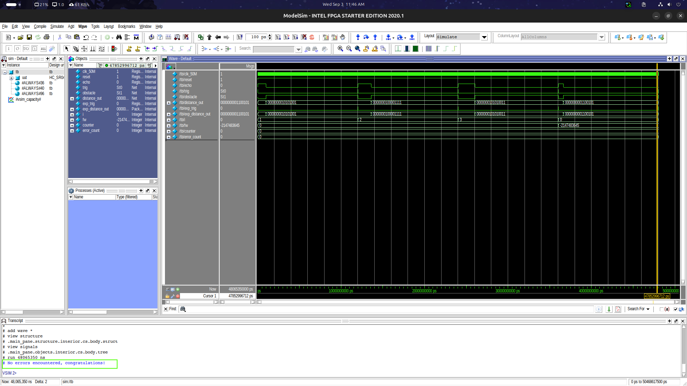

# Ultrasonic Distance Measurement using HC-SR04 (Verilog FSM)

## Description
This project implements an **ultrasonic distance measurement system using the HC-SR04 sensor in simulation**.  
The design is written in **Verilog HDL** and uses a **Finite State Machine (FSM)** to control the trigger signal, monitor the echo response, and calculate the distance of an object from the sensor.

The controller generates the required trigger pulse, measures the duration of the echo signal, and computes the distance in **millimeters**. It also indicates whether an obstacle is detected within a specific range.

---

## Module Interface

| Signal | Type | Description |
|------|------|-------------|
| `clk_50M` | Input | 50 MHz clock signal |
| `reset` | Input | Reset signal for the module |
| `echo` | Input | Echo signal returned from the ultrasonic sensor |
| `trig` | Output | Trigger signal sent to the ultrasonic sensor |
| `obstacle` | Output | Indicates obstacle detection (HIGH when object < 70 mm) |
| `distance_out` | Output | Measured distance in millimeters (8-bit output) |

---

## Working Principle

To operate the **HC-SR04 ultrasonic sensor**, the controller follows these timing steps:

1. Start with an **initial delay of 1 µs** to allow the sensor to stabilize.
2. Set the **TRIG signal HIGH for 10 µs** to transmit ultrasonic waves.
3. After triggering, monitor the **ECHO signal**.
4. When **ECHO becomes HIGH**, the sensor has detected the returning wave.
5. Measure the duration of the **ECHO pulse**.
6. When **ECHO goes LOW**, calculate the **distance in millimeters** based on the measured time.
7. The **TRIG signal must remain LOW** while the echo pulse is being measured.
8. Wait **12 ms before sending the next trigger pulse**.

This timing sequence is implemented using a **Finite State Machine (FSM)** to ensure correct operation.

---

## Simulation

